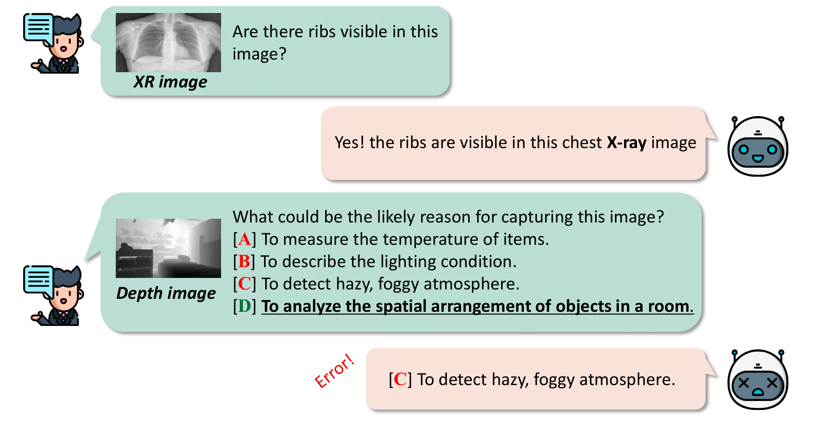
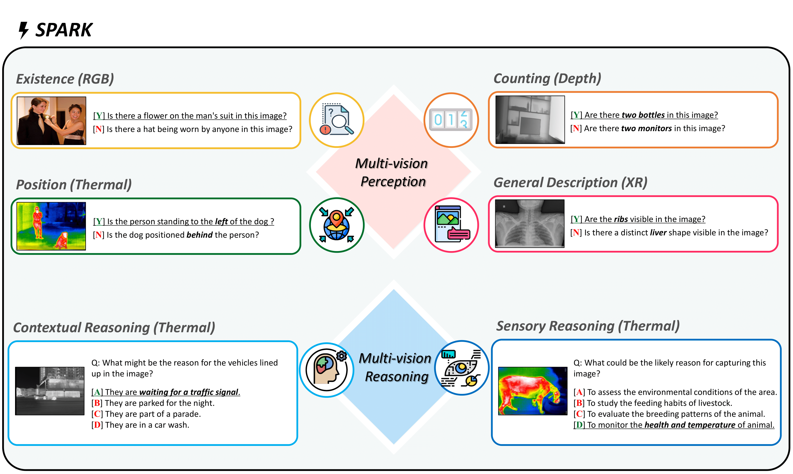
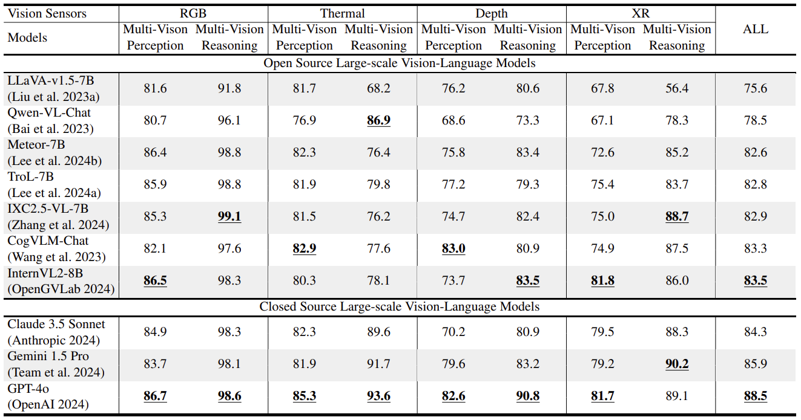

# ⚡ SPARK: multi-vision Sensor Perception And Reasoning benchmarK

[**🤗 Dataset**](https://huggingface.co/datasets/topyun/SPARK)

A benchmark dataset and simple code examples for **measuring the perception and reasoning of multi-sensor Large-scale Vision Language Models**.

# 📰 News

- **[2024.08.21]** We are currently awaiting the release of the arXiv paper

# 💡 Introduction

<p align="center">
  
</p>

Many Large-scale Vision-Language Models(LVLMs) have basic knowledge of various sensors such as thermal, depth, and X-ray, **but they do not attempt to view images while understanding the physical characteristics of each sensor.** Therefore, we have created a benchmark that can measure the differences between images and multi-vision sensor information.

# ⚡ SPARK ⚡
<p align="center">
  
</p>

The benchmark dataset consists of **four types of sensors(RGB, Thermal, Depth, X-ray) and six types of questions(Existence, Count, Position, Scene Description, Contextual Reasoning, Sensor Reasoning).** Examples of each are shown in the image above. It consists of approximately 6,000 questions and answers, with the questions broadly categorized into **Multi-vision Perception** and **Multi-vision Reasoning**.

# 🏆 SPARK Leaderboard

<p align="center">
  
</p>

#  How to Evaluation?

We have uploaded SPARK to Huggingface, and you can easily download the dataset as follows:
```python
from datasets import load_dataset
test_dataset = load_dataset("topyun/SPARK", split="train")
```

Additionally, we have provided two example codes for evaluation: Open Model and Closed Model. You can easily run them as shown below.

If you have 4 GPUs and want to run the experiment with llava-1.5-7b, you can do the following:
```bash
accelerate launch --config_file utils/ddp_accel_fp16.yaml \
--num_processes=4 \
test.py \
--batch_size 1 \
--model llava \
```

When running the closed model, make sure to insert your API KEY into the config.py file.
If you have 1 GPU and want to run the experiment with gpt-4o, you can do the following:
```bash
accelerate launch --config_file utils/ddp_accel_fp16.yaml \
--num_processes=$n_gpu \
test_closed_models.py \
--batch_size 8 \
--model gpt \
--multiprocess True \
```

## Tips

If the model you're evaluating provides unexpected answers (e.g., "Based on ..." or "Considering ..."), you can resolve this by adding "Do not include any additional text." at the end of the prompt.

