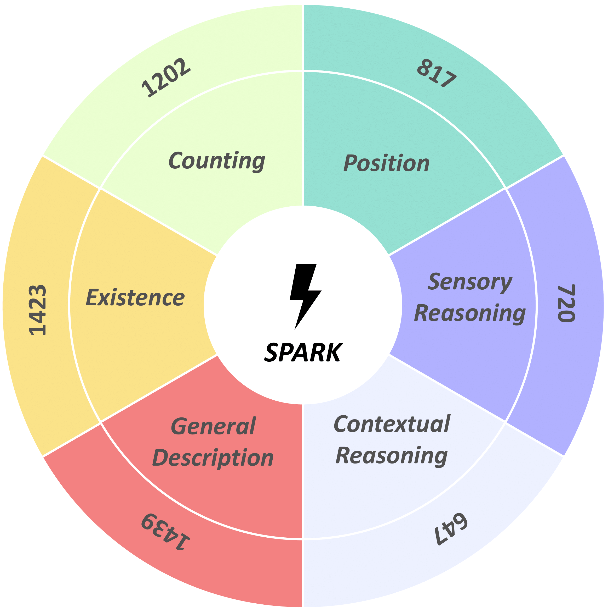

# SPARK: multi-vision Sensor Perception And Reasoning benchmarK 

[**🤗 Dataset**](https://huggingface.co/datasets/topyun/SPARK)

A benchmark dataset and simple code examples for **measuring the perception and reasoning of multi-sensor Large-scale Vision Language Models**.

# Problems

  

Many Large-scale Vision-Language Models(LVLMs) have basic knowledge of various sensors such as thermal, depth, and X-ray, **but they do not attempt to view images while understanding the physical characteristics of each sensor.** Therefore, we have created a benchmark that can measure the differences between images and multi-vision sensor information.

# Benchmark Information

  

The benchmark dataset consists of **four types of sensors(RGB, Thermal, Depth, X-ray) and six types of questions(Existence, Count, Position, Scene Description, Contextual Reasoning, Sensor Reasoning).** Examples of each are shown in the image above.

  

It consists of approximately 6,000 questions and answers, with the questions broadly categorized into **Multi-vision Perception** and **Multi-vision Reasoning**.

# SPARK Leaderboard

  

